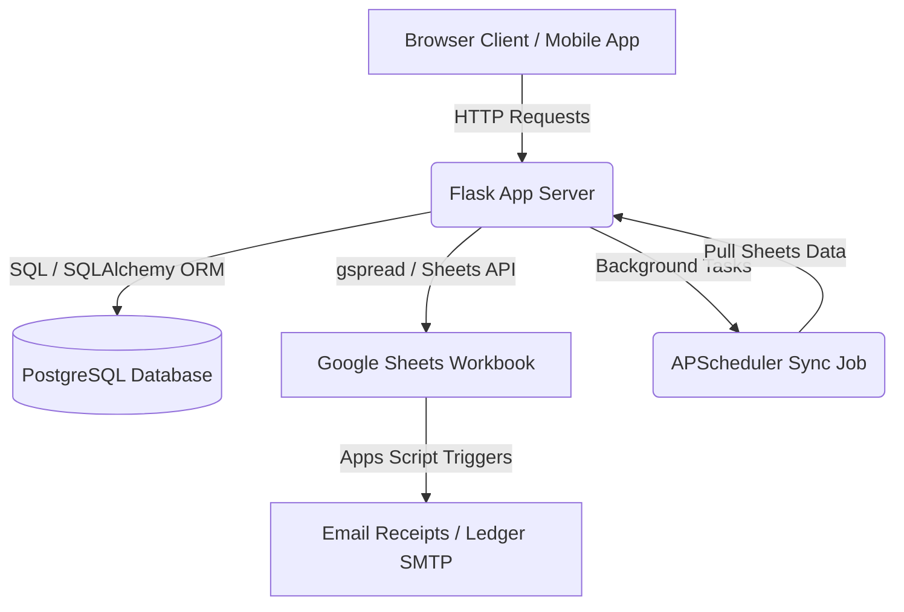

# System Architecture Map

## 1. High-Level System Architecture
The Cylinder Tracker application uses a hybrid architecture combining a local web application server (Flask), a relational database (PostgreSQL), and a spreadsheet database (Google Sheets).



---

## 2. Google Sheets Sync Architecture
Google Sheets acts as the user-friendly administration dashboard and config interface, while PostgreSQL serves as the fast operational backend database.

### Sync Directions
1. **Google Sheets to DB (Downstream Sync)**:
   * A background scheduler run by `APScheduler` inside `app.py` executes every 5 minutes.
   * It calls `sync_sheets_to_db(doc)` inside `sync.py`.
   * For each sheet (`Users`, `Customers`, `Cylinders`, `Cylinder Maintenance`, `Sheet1` (Scans), `Customer Map`, `Bulk Tanks`, `Products`), it reads the values and upserts them into PostgreSQL.
   * If records are deleted in Google Sheets, they are automatically purged from PostgreSQL.
2. **DB to Google Sheets (Upstream Write)**:
   * When a driver scans cylinders and submits a batch (via `/submit`), the server first performs write operations to the PostgreSQL database (`scans` and `cylinders` tables).
   * It then appends these scan events to Google Sheet's `Sheet1` using a retry mechanism (`sheets_write_with_retry`).
   * It also updates the status, current location, and last active date of each cylinder directly in the `Cylinders` Google Sheet.

---

## 3. Scheduler & Sync Flow
```
[Start Scheduler]
       │
       ▼
 ┌──────────┐
 │ Wait 5m  │
 └─────┬────┘
       │
       ▼
 ┌──────────────────────────────────────────────┐
 │ Fetch All Sheet Records (Users, Customers,   │
 │ Cylinders, Maintenance, Scans, Map, Tanks)   │
 └─────────────────────┬────────────────────────┘
                       │
                       ▼
 ┌──────────────────────────────────────────────┐
 │ For each sheet row:                          │
 │ ├─ Exists in DB? Update properties.           │
 │ └─ Missing in DB? Insert new record.         │
 └─────────────────────┬────────────────────────┘
                       │
                       ▼
 ┌──────────────────────────────────────────────┐
 │ Delete database records that are no longer   │
 │ present in the Google Sheets rows            │
 └─────────────────────┬────────────────────────┘
                       │
                       ▼
 ┌──────────────────────────────────────────────┐
 │ Commit SQL transaction & log sync results     │
 └─────────────────────┬────────────────────────┘
                       │
                       └────────────────────────┘
```

---

## 4. Report Generation Flow
The application generates daily reports dynamically:
* **Excel Reports**: Generated using the `openpyxl` library in python. The server queries the database for stock status, bulk tanks, and party-wise dispatch counts, dynamically formats cells, sets column widths, and streams the XLSX buffer to the client via `send_file`.
* **PDF Reports**: Generated using the `ReportLab` library. It builds multi-page documents comprising:
  * Page 1: Stock Status (Filled Inventory) & Bulk Tank usable gas balances.
  * Page 2: Daily Dispatch Matrix (Party Name vs. Gas type dispatch/collection count).
  It uses ReportLab's `SimpleDocTemplate` to structure the flowables and streams the PDF buffer back to the user.
